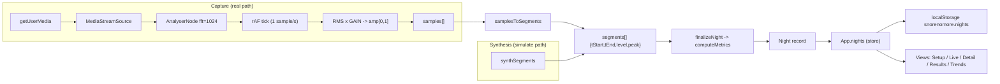
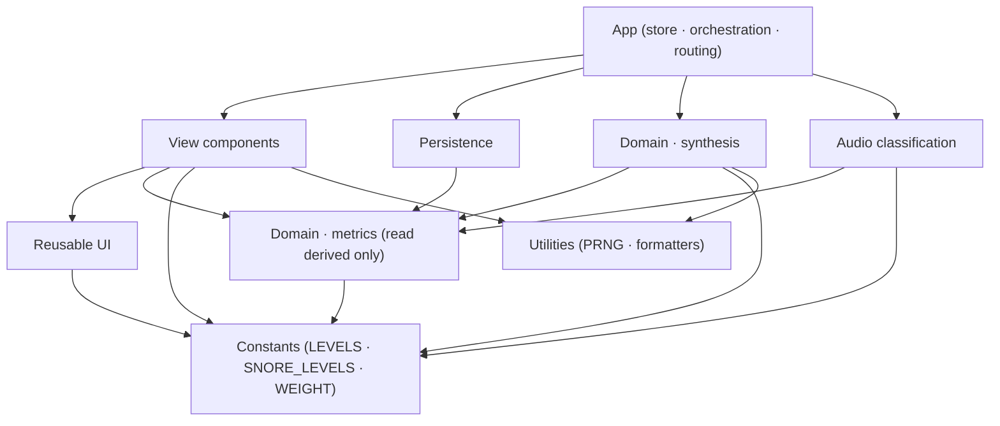
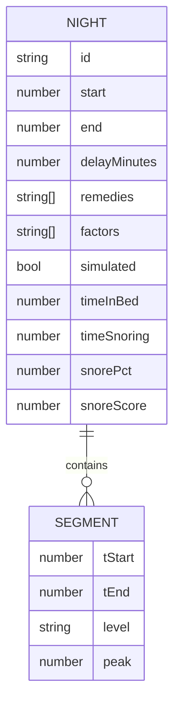

# Architecture Spine — SnoreNoMore

> Retro-spec spine derived from the already-shipped, round-1-accepted build. It ratifies the
> invariants the running code already obeys; the code owns all structural detail below the spine.
> `[ADOPTED]` marks a decision settled by shipped reality, not one still open.

## Design Paradigm

**Single-module reactive SPA over a pipes-and-filters audio pipeline.** One ES-module `<script>` in
`index.html` hosts the whole app; there is no bundler and no file split. Inside that one module the
code is organized into fixed, comment-delimited **sections** that act as de-facto module boundaries:

| Section (in-file) | Responsibility |
| --- | --- |
| Constants | Level taxonomy, remedy/factor catalogs, delays, storage keys, disclaimer |
| Icons | Inline lucide SVG path registry (`Icon`) |
| Utilities | PRNG (`mulberry32`), formatters, `scoreColor`/`scoreWord`, `uid`, month keys |
| Domain · metrics | `computeMetrics` / `finalizeNight` — the authoritative quantification |
| Domain · synthesis | `propensityFor` / `synthSegments` / `synthesizeNight` — the simulate/demo generator |
| Persistence | `loadNights` / `persist` / `seedDemoNights` — the localStorage layer |
| Audio classification | `ampToLevel` / `samplesToSegments` — level bucketing + segment building |
| Reusable UI | `Disclaimer`, `Gauge`, `TimelineBar`, `Spikes`, `Legend`, `MiniScore` |
| View components | `Setup`, `LiveScreen`, `Detail`, `Results`, `Trends`, `NavBar` (+ leaves) |
| App (root) | State/store, real-recording orchestration, simulate, persistence writes, routing |

The **data spine** is a one-way pipeline; the **UI spine** is unidirectional state → pure views:



## Invariants & Rules

### AD-1 — Single-file, zero-build, CDN-ESM delivery `[ADOPTED]`
- **Binds:** all
- **Prevents:** introducing a bundler / `npm install` / compile step, or a source split that needs one
- **Rule:** the whole app ships as one static `index.html` + `manifest.json`; every dependency loads
  from a CDN (ESM `import` or `<script>`); it must run when served statically with no build.

### AD-2 — On-device-only, zero egress `[ADOPTED]`
- **Binds:** all data · CAP-6
- **Prevents:** any feature adding `fetch`/`XHR`/`sendBeacon`/`WebSocket` that carries audio or night data
- **Rule:** no network call may carry audio or night data off-device; the only permitted network is the
  initial CDN asset fetch. Privacy is structural, not a setting.

### AD-3 — Canonical night-record contract + authoritative formulas
- **Binds:** CAP-2, CAP-3, CAP-4, CAP-5
- **Prevents:** real, simulate, persistence, and views drifting on record shape or metric math
- **Rule:** every night (real *or* simulated) is the single documented record shape and derives
  `timeInBed` / `timeSnoring` / `snorePct` / `snoreScore` **only** via `finalizeNight`→`computeMetrics`.
  Views read the persisted derived fields; no view recomputes metrics. Formulas are frozen:
  `timeInBed = end − start − delay`; `timeSnoring = Σ(Light+Loud+Epic)`; `snorePct = timeSnoring/timeInBed`;
  `snoreScore ∈ [0,10]` from `snorePct` + loudness weight.

### AD-4 — Segment is the universal intermediate representation
- **Binds:** CAP-2
- **Prevents:** the demo path weakening the real mic path, or the two emitting incompatible shapes
- **Rule:** capture (`samples → ampToLevel → samplesToSegments`) and synthesis (`synthSegments`) both
  emit `segments[]` of `{tStart, tEnd, level, peak}`; **`tStart`/`tEnd` are 0-based ms from capture
  start** (not absolute epoch), `level ∈ LEVELS`, `peak ∈ [0,1]`. Everything downstream is
  source-agnostic except the `simulated` flag. The absolute clock anchor is `start + delay`.

### AD-5 — Level taxonomy + snore membership are one source of truth
- **Binds:** classification, metrics, all views
- **Prevents:** `Noise` being counted as snore, or a view using different thresholds
- **Rule:** `LEVELS = [Quiet, Light, Loud, Epic, Noise]`; `SNORE_LEVELS = [Light, Loud, Epic]`
  (Quiet and Noise never count toward `timeSnoring`). `ampToLevel` thresholds and the `WEIGHT` map are
  the only classifiers; any new consumer imports them, never redefines them. The synthesis path assigns
  level labels directly (label → peak band) rather than through `ampToLevel`, so its per-level peak
  bands **must stay consistent with the `ampToLevel` thresholds** — retuning a threshold requires
  retuning the matching synth band, or a simulated segment's `peak` would no longer classify to its own
  `level`. The taxonomy + thresholds are the shared contract both the classifier and the synthesizer honor.

### AD-6 — Delay-window suppression is capture-time, not post-filtering
- **Binds:** CAP-2
- **Prevents:** a variant that records through the delay then trims, leaking pre-sleep audio
- **Rule:** no samples are captured during the fall-asleep delay window; `timeInBed = end − start − delay`;
  *skip-delay* collapses the remaining window by setting `delay` to elapsed. Segments only ever cover
  post-delay capture.

### AD-7 — Persistence namespace + single writer
- **Binds:** CAP-4
- **Prevents:** scattered localStorage keys, or views writing storage directly
- **Rule:** all persistence lives under `snorenomore.*` — the nights array at `snorenomore.nights`
  (newest-first), the seed guard at `snorenomore.seeded`. Only the App root (`saveNight`/`deleteNight`/
  seed) mutates storage, always mirroring the in-memory `nights` state. Reads tolerate corrupt/absent
  storage by returning `[]`.

### AD-8 — Unidirectional state; views are pure projections
- **Binds:** all UI
- **Prevents:** view components holding their own copies of night data, or mutating storage
- **Rule:** `App.nights` is the single source of truth; child views receive data + callbacks as props,
  never touch localStorage and never recompute persisted metrics. Ephemeral UI state (tag selection,
  search text, window toggle, `detailId`) stays local to the leaf.

### AD-9 — Imperative audio isolated behind refs, outside the render cycle
- **Binds:** CAP-2
- **Prevents:** the audio graph and rAF loop churning component state or leaking across renders
- **Rule:** `AudioContext` / stream / `AnalyserNode` and the recording accumulator live in **refs**
  driven by a single `requestAnimationFrame` loop; sampling (1/s) and UI updates (~3/s) are throttled
  separately; teardown (`stopAudio`) stops tracks and closes the context on stop **and** on unmount.

### AD-10 — Overlay precedence for full-screen modes
- **Binds:** navigation
- **Prevents:** the user navigating away from a running night, or two overlays fighting
- **Rule:** render precedence is **recording (Live) > detailNight (Detail) > tab view**; the `NavBar`
  renders only when neither overlay is active, so a running capture cannot be abandoned by a tab tap.

### AD-11 — Simulated data must be self-identifying
- **Binds:** CAP-2 · demo honesty (C3 / BA-4)
- **Prevents:** synthetic nights masquerading as measured
- **Rule:** synthesized nights carry `simulated: true` and are surfaced as such in the UI; aggregations
  may include them but the provenance flag is never dropped from the record.

### Dependency direction



Rule of the graph: **Constants and Utilities depend on nothing; Domain depends only on those; UI/Views
depend on Domain read-only; only App may write persistence or drive audio.** No arrow points back up.

## Consistency Conventions

| Concern | Convention |
| --- | --- |
| Component style | Preact function components + hooks, authored in HTM tagged templates (`html\`...\``); no JSX/build |
| Naming | Components `PascalCase`; helpers/domain fns `camelCase`; storage keys `snorenomore.*`; night id `uid()` → `n_<base36>` |
| Segment timing | `tStart`/`tEnd` = 0-based ms from capture start; absolute clock = `start + delayMinutes*60000 + tStart` |
| Night record shape | `{id, start, end, delayMinutes, remedies[], factors[], segments[], simulated}` + derived `{timeInBed, timeSnoring, snorePct, snoreScore}` |
| Serialization | `JSON.stringify`/`parse` of the nights array under one key; new fields must be back-compatible (old records lack them) |
| Metrics ownership | Only `computeMetrics` computes; views format via `fmtDur`/`fmtClock`/`scoreColor`/`scoreWord` |
| Determinism | All synthetic/demo data uses the seeded `mulberry32` PRNG so a given seed reproduces a night |
| Error handling | Storage and audio-teardown failures are swallowed to keep the UI alive (degrade, don't crash) |
| Styling | Tailwind utility classes inline; dark `slate-950` base; level/score colors come from the `LEVEL_COLORS`/`scoreColor` maps, never ad-hoc hex in views |
| Compliance | `DISCLAIMER` string rendered on Setup, Live, Detail, Trends; no diagnosis wording; no waking alarm |

## Stack

| Name | Version |
| --- | --- |
| Preact + preact/hooks (esm.sh) | 10.24.3 |
| htm (esm.sh) | 3.1.1 |
| Tailwind Play CDN | latest v3 (unversioned) |
| lucide icons | hand-inlined SVG path strings (no runtime dep) |
| Web Audio (`getUserMedia` + `AnalyserNode`) | platform |
| localStorage | platform |
| Target runtime | Mobile Safari, iPhone SE 2023 (375×667), standalone PWA |

Versions are **ratified from the running, round-1-accepted build**, not re-selected — upgrading deps is
out of scope for this retro-spec.

## Structural Seed

### Night-record entity (the one shared shape)



### Deliverable tree

```text
snorelab-local/
  index.html      # the entire app: constants · icons · utils · domain · persistence · audio · UI · App
  manifest.json   # PWA manifest (standalone, portrait, data-URI icon)
```

### Runtime state (App root)

```text
nights: Night[]        # source of truth, mirrored to localStorage
view: 'record'|'results'|'trends'
detailId: string|null  # open Detail overlay
live: {phase,elapsed,delayRemaining,level,sampleCount,mode}|null  # active capture
refs: audioRef {ctx,stream,analyser,data} · recRef {accumulator} · rafRef
```

## Capability → Architecture Map

| Capability | Lives in | Governed by |
| --- | --- | --- |
| CAP-1 Setup & tagging | `Setup` / `TagItem` / `InfoModal` | AD-8, conventions |
| CAP-2 Capture & classification | `App.startReal` + rAF loop, `ampToLevel`, `samplesToSegments`, `synthesizeNight` | AD-2, AD-4, AD-5, AD-6, AD-9, AD-11 |
| CAP-3 Quantify & detail | `computeMetrics`/`finalizeNight`, `Detail`/`HourlyGraph`/`Gauge`/`TimelineBar` | AD-3, AD-4, AD-5, AD-8 |
| CAP-4 Results history | `Results`, `Persistence` | AD-7, AD-8 |
| CAP-5 Trends correlation | `Trends` (ON/OFF selectors over `nights`) | AD-3, AD-8 |
| CAP-6 Compliance & privacy | `Disclaimer`, absence of any egress path | AD-2, conventions |

## Backlog Landing (§10 items — where they attach)

All eight are **additive selectors/UI over the existing night-record contract; none needs a schema
migration.** They attach without touching AD-1..AD-11.

| Item | Attaches as | Reads / respects |
| --- | --- | --- |
| **BA-1** min nights-per-side before a "helps" claim | Pure predicate in a new *Trends-stats* helper beside `computeMetrics`; gates the verdict in `Trends` | AD-3 (aggregate persisted `snoreScore`, don't recompute), AD-8 |
| **BA-2** sample-size honesty (spread/±) | Same Trends-stats helper computes spread over the ON/OFF nights' `snoreScore`; `Trends` renders a whisker/hedge | AD-3, AD-8 |
| **BA-3** de-dupe / label same-day nights | Grouping selector keyed on `night.start` (calendar day) in `Results`; `Trends` treats same-day nights as distinct, labels the day once | AD-4 (0-based segments ⇒ day comes from `start`), AD-7, AD-8 |
| **UX-4** tap-to-inspect spike times | `Detail` maps a tapped segment/spike to clock time `start + delay*60000 + tStart`, reading `level`+`peak` already on the segment | AD-4 (the 0-based-timing invariant is exactly what makes this correct), AD-5 |
| **UX-1** Trends default to a both-sides remedy | Default-selection selector scanning the window in `Trends` | AD-8 |
| **UX-2** mic-permission priming | One-time sheet before `getUserMedia`, reusing `InfoModal`; real-path only | AD-2 (reinforces), AD-9 |
| **UX-3** always-tappable (i) tag info | `TagItem` — guarantee the (i) hit area in the selected state too | conventions (≥44px target) |
| **BA-4** clarify demo vs real | Strengthen the `simulated` surfacing to an explicit badge + note in `Detail`/`Results` | AD-11 |

## Trade-offs & Risks

| # | Risk | Recommendation |
| --- | --- | --- |
| R1 | **rAF-gated all-night capture.** `requestAnimationFrame` pauses when the screen locks / app backgrounds → missing samples read as silence. Background-survival is UX *intent* only. Top real-path risk. | Add a wake-lock / time-anchored resampling strategy, or scope the real path to foreground use; the simulate path already sidesteps it. Metrics are `Date.now`-anchored, so *elapsed* math survives — only sampling cadence is at risk. |
| R2 | **CDN dependency + no service worker.** First load requires network; a CDN (esm.sh / Tailwind) outage breaks the app; "offline after first load" (NFR-7) relies on unguaranteed HTTP cache. | Add a service worker caching the shell + **pinned** CDN assets, or vendor Preact/htm/Tailwind as local static files — both keep zero-build. Highest-value hardening. |
| R3 | **Tailwind Play CDN in production.** Emits a console warning and recompiles utilities at runtime. | Accepted at this scale; if hardened, precompile to a static stylesheet (still no app build). |
| R4 | **localStorage quota / silent loss.** `persist` swallows quota errors; a full store loses the night silently. | Surface quota errors to the user; migrate to IndexedDB if segment granularity or history grows large. |
| R5 | **Single-file maintainability.** ~1050 lines in one module; section comments are the only structure. | Keep the section boundaries as contracts; if it outgrows one file, split into ES modules loaded via `<script type=module>` imports — never a bundler (AD-1). |

## Deferred

- **Operational envelope (deploy/infra/ops):** intentionally none — static hosting only (any static
  server / `python -m http.server`); no backend, CI/CD, environments, or observability by design (AD-2).
- **Offline/service-worker strategy:** deferred to the R2 remediation; not in the shipped build.
- **Background/wake-lock capture strategy:** deferred to the R1 remediation.
- **`N_min` threshold value (BA-1):** a product/data-owner number; the spine fixes *where* the gate
  lives, not the value.
- **BreathFlow upgrade:** placeholder only; its architecture is out of scope until specified.
- **Trends beyond 7/30 days, accounts, cloud sync, app-store build:** explicit non-goals.
