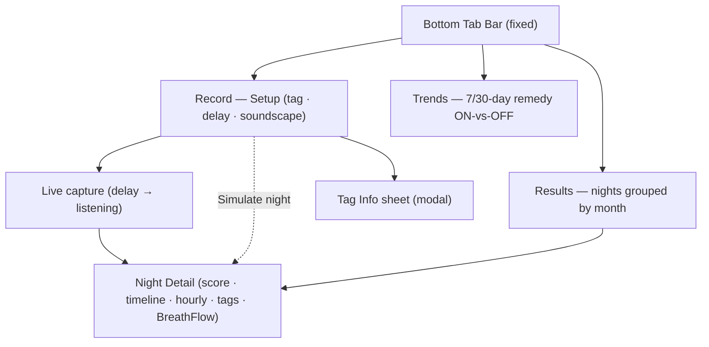

# SnoreNoMore — Experience Spine

> This EXPERIENCE.md owns *how it works* — information architecture, behavior, states, interaction
> primitives, accessibility, and journeys. Visual identity (color, type, shape, component looks) lives
> in the peer [DESIGN.md](DESIGN.md); tokens are referenced by name as `{path.to.token}`. Both spines
> win on conflict with any mock or import.
>
> **Frozen outcome this experience must deliver:** an adult snorer can tag up to **3 remedies + 2
> factors**, pick a fall-asleep delay, and **start recording in under 10 seconds**; in the morning,
> immediately see a **segmented Quiet/Light/Loud/Epic/Noise timeline with spikes**, a **circular Snore
> Score 0–10**, and **Time Snoring + %**; and open a **7-day Trends** view comparing a remedy's average
> score **ON vs OFF** — the full Measure → Quantify → Correlate → Feedback loop.

## Foundation

- **Form factor.** Single-hand mobile, portrait-only, **375×667** (iPhone SE 2023) as the hard design
  target; centered `{spacing.page.maxWidth}` column. Installed as a **standalone PWA** (Add to Home
  Screen) — no browser chrome, black-translucent status bar, `viewport-fit=cover`.
- **UI system.** No third-party design system. Preact + HTM components, Tailwind Play-CDN utility
  classes, lucide icons. The visual identity reference is DESIGN.md; this document specifies behavior
  only.
- **Context of use.** A dark bedroom at night (setup + start) and again groggy at dawn (morning read).
  Both bookends demand **low cognitive load, high tap-tolerance, minimal reading**.
- **Offline & local by construction.** Everything runs on-device; night records persist in
  `localStorage` under one key. No network path carries audio or night data. The experience never
  shows a "syncing / signing in / connecting" state because none exists.
- **First-run seeding.** On first launch with no data, the app silently seeds a deterministic **demo
  week** (Side-Sleeping nights score lower) so Results and Trends are immediately meaningful rather
  than empty. Seeded/simulated nights are marked `· sim`.

## Information Architecture

Flat, three-destination tab shell — no nesting deeper than one modal layer.

**Three primary destinations** (tab bar, `{components.navBar}`):

1. **Record** — the nightly entry point and default landing tab. Hosts **Setup** (tagging, delay,
   soundscape, Start/Simulate) and, when a night is running, the full-screen **Live** capture screen.
2. **Results** — history of persisted nights, **grouped by month**, newest first; each row opens
   **Detail**.
3. **Trends** — 7-day (7/30 toggle) remedy **ON-vs-OFF** correlation.

**Overlays (above the shell, not tabs):**
- **Night Detail** — full-screen slate-950 layer reached from Live-stop, Simulate, or a Results row.
  Owns its own Back and Delete.
- **Tag Info sheet** — bottom sheet from a tag's (i) affordance.
- **Live capture** — replaces the shell entirely while recording; the tab bar is hidden/disabled so
  the user can't accidentally navigate away from a running night.

**Surface-closure check.** Every stated need has exactly one surface and every surface has a journey
that lands there: tag+start → Record/Setup; measure → Live; quantify+read → Detail; history → Results;
feedback → Trends; compliance → Disclaimer on Setup/Detail/Trends. No orphan surfaces; no unmet need.

**Disclaimer placement (FR-23, mandatory).** "Not medical advice. For apnea risk see doctor. No
diagnosis." appears at the foot of **Setup**, inside **Live** (centered), on **Detail** (foot), and on
**Trends** (foot). It is quiet (`{components.disclaimer}`) but never scrolled fully out of the flow —
present on every surface where a user could read a result.

## Voice and Tone

Microcopy is **plain, warm, and honest** — a helpful bedside companion, never a clinician. (Brand
voice-in-pixels lives in DESIGN.md · Brand & Style.)

- **Encouraging, low-pressure.** "Tag, then start in seconds." "Start your first night."
- **Privacy stated as fact, not marketing.** "audio stays on this device", "Recording is skipped
  during this window."
- **Honest verdicts over flattering ones.** Trends says "No clear difference yet." or "…not helping
  here." — it will tell the user a remedy didn't help.
- **Never diagnostic.** No "apnea", "risk score", "healthy/unhealthy". Snoring is described in neutral
  qualitative words: **Silent · Minimal · Mild · Moderate · Heavy**.
- **Numbers own the meaning; words soften it.** The score is the fact; "Mild snoring" is the gloss.

Canonical strings: `DISCLAIMER` = "Not medical advice. For apnea risk see doctor."; mic-denial fallback
points the user to **Simulate night**; empty Trends says "Need nights both with and without {remedy} to
compare."

## Component Patterns (behavioral)

Visual specs in DESIGN.md · Components. Here: what each does.

- **DelayPicker** (`{components.delayPicker}`) — single-select 5/10/15/20/30m; default **10m**. Choice
  sets the window during which capture is suppressed. Immediate visual commit; no confirm.
- **SoundscapeToggle** (`{components.soundscapeToggle}`) — optional per-night on/off; default off.
  Purely a comfort intent flag for the night; does not gate Start.
- **Tag multi-select** (`{components.tagTile}`) — searchable 2-up grids for **Remedies (cap 3)** and
  **Factors (cap 2)**. Selecting toggles a check badge and increments a live **N/max** counter that
  turns sky at the cap. At cap, unselected tiles go **disabled** (muted) — selection is blocked, not
  hidden, so the cap is legible. Search filters both grids live; no-match shows "No matches."
- **Tag info affordance** — every tile exposes an **(i)** the user can **tap** (stops propagation, no
  toggle) *and* a **long-press** (~450ms) on the tile body; both open the **Info sheet**. Long-press
  suppresses the ensuing toggle so reading never accidentally selects.
- **InfoSheet** (`{components.infoSheet}`) — bottom sheet describing one tag; dismiss via "Got it",
  scrim tap. Read-only.
- **StickyActionBar** (`{components.stickyActionBar}`) — persistent on Setup: **Confirm & Start Night**
  (primary; shows live "· N rem, M fac" so the user sees their selections are captured), **Simulate
  night** (secondary, emerald — the desk-demo/no-mic path), and **Results** (appears once nights
  exist).
- **LiveRing** (`{components.liveRing}`) — during capture, animates/tints to the current classified
  level and counts elapsed time; shows a phase label ("Falling asleep…" vs "Listening to the night")
  and a sample counter with the privacy reassurance line.
- **Gauge / MiniScore** (`{components.gauge}`) — the circular Snore Score; color = threshold. MiniScore
  is the 32px row variant.
- **TimelineBar + Spikes** (`{components.timelineBar}`) — the segmented intensity timeline; spikes
  (peak polyline) shown only in Detail. Mini (8px, no spikes) in Results rows.
- **HourlyGraph** (`{components.onOffBars}` sibling) — snore-only stacked bars per hour with clock
  ticks; answers "when in the night was it worst?".
- **ON/OFF bars + verdict** — the correlation payload; see Key Flow C.
- **NavBar** — 3 tabs; disabled/hidden during Live and Detail.

## State Patterns

Every surface defines its **empty · populated · in-progress · error/permission** states.

**Setup**
- *Ready (default):* delay=10m, soundscape off, 0/3 remedies, 0/2 factors; Start is always enabled
  (tags are optional context, not required) so the <10s outcome is never blocked.
- *At-cap:* counter turns sky; further unselected tiles disabled.
- *Search no-match:* "No matches." in the affected grid; other grid unaffected.

**Live capture**
- *Delay phase:* neutral slate ring, "Falling asleep…", countdown "Recording starts in Xm", and a
  **Skip delay & record now** shortcut. Capture is genuinely suppressed until the window elapses.
- *Listening phase:* ring tints to live level, elapsed "in bed" timer, level pill, sample count +
  "audio stays on this device."
- *Mic denied (error):* see Interaction Primitives → Permissions. The night does not start; the user is
  routed to **Simulate**.
- *Stop:* computes metrics and transitions straight into **Detail** (no interstitial).

**Detail**
- Always populated (it only opens for a real/simulated night). Shows `· sim` when synthetic. Tags block
  hidden when a night had no tags. Delete returns to the prior surface.

**Results**
- *Empty:* moon glyph, "No nights yet.", primary "Start your first night" → Record. (In practice the
  first-run seed means a fresh install lands populated.)
- *Populated:* month-grouped sections ("August 2026"), each row = MiniScore + day label + "Xh Ym
  snoring" + mini-timeline + remedy/factor icons (or "no tags"). Newest first.

**Trends**
- *No nights in window:* "No nights in the last N days." + **Simulate a night** CTA.
- *Comparable:* ON/OFF bars + honest verdict + nightly-scores strip.
- *One-sided (ON or OFF empty):* bars still render with a `—` null stub on the empty side and the
  gating line "Need nights both with and without {remedy} to compare." — **no verdict is fabricated**
  from one side. (This is the empty-state gating FR-22 requires and the seam UX-1/BA-1/BA-2 refine.)

## Interaction Primitives

- **Tap** — the universal primitive; every actionable target ≥44px effective.
- **Long-press (~450ms)** on a tag body — opens Info; cancels on pointer-leave/cancel; suppresses the
  subsequent toggle click. **Redundant** with the always-present tap (i) so it is an enhancement, never
  the only path (see Accessibility Floor).
- **Toggle-with-cap** — selecting past the cap is a no-op; the disabled visual is the feedback.
- **Single-select commit** — delay tiles and Trends remedy chips commit on tap, no confirm.
- **Skip delay** — collapses the remaining delay window and begins capture immediately.
- **Stop → Detail** — one tap ends the night and reveals results; there is no "are you sure" because
  the data is saved, not discarded.
- **Scrim / Back / Delete** — modal dismissal (scrim tap or "Got it"); Detail Back returns to origin;
  Delete removes the night and closes Detail.
- **Permissions (getUserMedia)** — requested only at **Start of a real night**, never at launch.

## Accessibility Floor

Scoped to the stated iPhone SE target (PRD NFR-9 / A4); full WCAG conformance is out of scope for this
lifestyle tool, but these are non-negotiable:

- **No meaning by color alone.** The timeline pairs with a **Legend**; ON/OFF bars pair with **text
  values + counts**; the score pairs with a **word** (Minimal…Heavy). A colorblind user can read every
  result.
- **No essential action behind long-press only.** Tag info is reachable by the **visible (i) tap**
  target on every tile; long-press is a power-user shortcut. *(This is the shipped basis for backlog
  UX-3 — see below.)*
- **Touch targets.** Tiles, tabs, delay pills, and CTAs meet the `{spacing.tap.min}` effective floor;
  the trailing (i) has its own padded hit area distinct from the tile toggle.
- **Legible in the dark.** Type sizes and the DESIGN.md contrast rules assume a dimmed screen; the one
  weak token (`{colors.level.Light}` yellow) is never used for small standalone text.
- **Motion restraint.** The only looping animation is the live recording ring; nothing flashes.
  fade-up entrance is brief (250ms) and non-essential.
- **Reduced-motion intent.** Honor `prefers-reduced-motion` by damping the pulse/fade (behavioral
  intent for the build; see Open UX notes).
- **Labels for icon-only controls.** Icon-only targets (nav tabs, trash, back chevron, (i)) carry
  accessible names so VoiceOver announces intent.

## Responsive & Platform

- **Single breakpoint.** Design is fixed to the mobile column; the 430px max-width simply centers on
  larger glass. No tablet/desktop layout is in scope.
- **Standalone PWA behaviors.** No pull-to-refresh (overscroll disabled), no text-select on chrome,
  status-bar-safe top padding, home-indicator-safe bottom padding above the nav.
- **Wake/lock during capture.** An all-night capture runs with the screen likely locked; the
  experience must survive backgrounding and resume its timer/state on return (behavioral intent; the
  measurement is time-anchored, not frame-anchored).

## Key Flows

### Flow A — "Dan starts a night in under 10 seconds" (Measure)

*Dan, 41, has been told he snores. It's 11:40pm, lights already off, phone on the nightstand.*

1. Dan opens SnoreNoMore → lands on **Record / Setup** (default tab).
2. He leaves delay at **10m**, taps **Side Sleeping** (check appears, counter → 1/3), taps **Alcohol**
   (1/2) — his two honest tags for tonight.
3. He taps **Confirm & Start Night**; the button already reads "· 1 rem, 1 fac", so he trusts his
   context is captured.
4. iOS asks for the mic **once**; he allows. **← climax:** the screen flips to the **Live** ring
   reading "Falling asleep… Recording starts in 10m", and he puts the phone down. Elapsed from open to
   running: well under 10s.
5. Capture is suppressed through the delay, then the ring begins tinting to the night's real levels.

*Failure branch:* if he denies the mic, an alert explains "no audio ever leaves your device" and offers
**Simulate night** so the loop is still demonstrable; the real path is untouched.

### Flow B — "The morning read" (Quantify)

*6:50am. Dan wakes, groggy, and taps Stop.*

1. From **Live**, Dan taps **Stop & see results**. Metrics compute instantly.
2. **← climax:** **Detail** opens directly onto a **circular Snore Score** (e.g. 4.1, amber) with
   "Mild snoring", and the three-up **In bed / Snoring / % of night** cards — the whole night in one
   glance, no extra taps (M3).
3. Below, the **segmented timeline** (Quiet→Noise) with the **spike** line shows the night's shape; the
   **Legend** decodes it; **Snoring by hour** shows when it peaked.
4. His **tags** for the night are chipped back to him; a **BreathFlow upgrade** teaser sits at the
   bottom; the **disclaimer** closes the screen.
5. He taps **Back** → the night is now the newest row in **Results** under this month.

### Flow C — "Is side-sleeping actually working?" (Correlate → Feedback)

*A week later, Dan wants proof before committing to a wedge pillow.*

1. Dan taps **Trends**. It opens on **7 days** with a remedy **already selected that has both ON and
   OFF nights** (so he sees a real comparison, not an empty prompt — the UX-1 behavior).
2. He sees **Avg Snore Score · Side Sleeping**: **ON 2.7 (5 nights)** vs **OFF 4.9 (4 nights)**, ON in
   emerald, OFF in red.
3. **← climax:** the honest verdict reads *"Side Sleeping averages 2.2 points lower — it seems to
   help."* Dan has evidence, in his own data, and decides to keep side-sleeping.
4. He taps **Nasal Strip** to compare; if a side has too few nights, the app **withholds the verdict**
   and tells him what's missing rather than overclaiming.

## UX Direction for the §10 Backlog

Concrete design intent for the eight non-blocking items. None change the frozen outcome; they raise
trust, honesty, and accessibility.

### UX-1 · Trends defaults to a remedy with both ON and OFF nights (P1)
- **Behavior:** On entering Trends, don't hard-default to "Side Sleeping." Pick the default remedy by
  scanning the current window for the remedy that has **≥1 ON and ≥1 OFF** night (and, once BA-1
  lands, that meets the minimum-per-side threshold); prefer the one with the **largest combined
  night count**, tie-break by strongest effect. If none qualifies, default to the most-tagged remedy
  and show the gating line rather than an accidental empty comparison.
- **UI:** selected chip reflects the computed default; no new control. First paint = a meaningful
  ON-vs-OFF chart.
- **Acceptance:** first-run Trends never opens on a one-sided/empty comparison when a comparable remedy
  exists in the window.

### UX-2 · Mic-permission priming (P3)
- **Behavior:** Before the first-ever `getUserMedia` call, show a **one-time priming sheet** (reuse the
  `{components.infoSheet}` pattern) that says, in this order: *what* ("SnoreNoMore listens through your
  mic overnight"), *the privacy promise* ("Audio never leaves this device — nothing is uploaded"), and
  *the speed* ("You'll be recording in seconds"). Buttons: **Allow microphone** (triggers the real OS
  prompt) and **Not now — simulate instead**.
- **Placement/timing:** only on the real Start path, only when permission state is `prompt`; never at
  launch, never before Simulate. Skip entirely if already granted.
- **Denied state:** keep the existing honest fallback but make it a sheet, not a bare `alert`, with a
  primary **Simulate night** action and a **How to enable in Settings** hint.
- **Acceptance:** the OS prompt is always preceded by context; denial still lets the user complete the
  loop via Simulate; reinforces G4 privacy + the <10s feel.

### UX-3 · Tappable (i) tag info, not long-press only (P2)
- **Status:** the shipped build **already** renders a tappable (i) on unselected tiles; long-press is
  the redundant enhancement. This item **hardens and completes** that parity.
- **Behavior:** guarantee the (i) is present and tappable in **all** tile states — including **selected**
  tiles (where the check currently replaces the (i)). Give selected tiles a small (i) alongside/behind
  the check, or move info to a persistent leading affordance, so a user who has selected a tag can
  still read what it is without deselecting.
- **Hit area & a11y:** ≥44px padded target, `aria-label="About {tag name}"`, stops propagation so it
  never toggles selection.
- **Acceptance:** every tag's info is reachable by a single visible tap in every state; long-press
  remains as a shortcut, never the sole path (satisfies NFR-9).

### UX-4 · Tap-to-inspect spike times (P2)
- **Behavior:** make the Detail **timeline** and **hourly graph** interrogable. Tapping a segment/spike
  (or the hourly bar) reveals a small **inspector**: the **clock time** of that moment (mapped through
  `start + delay`), the **level**, and the **peak** value; tapping the hourly bar lists that hour's
  worst spikes.
- **UI:** a lightweight popover/tooltip anchored to the tapped point, dismiss on next tap/scroll; the
  spike polyline gains tappable hit regions. No layout reflow.
- **A11y:** each interactive spike/bar carries an accessible name ("Loud spike at 2:14am, peak 0.31").
- **Acceptance:** an engaged user can answer "when did I snore worst?" by tapping the chart, not just
  reading shape.

### BA-1 · Minimum nights-per-side threshold before any "helps" claim (P1 — UX surface)
- **UX intent:** define a threshold `N_min` (design assumes **N_min = 2** per side pending data owner
  confirmation). Below it on either side, the verdict line is **suppressed** and replaced with a
  neutral status: *"Not enough nights yet — need at least {N_min} with and without {remedy}."* The
  bars may still render as context, but never a "seems to help/worse" claim.

### BA-2 · Sample-size honesty alongside ON/OFF averages (P1 — UX surface)
- **UX intent:** under each ON/OFF value, show the **n** (already present) plus a **spread indicator**
  — a thin range whisker or "±X" derived from the nights on that side — so a 2.7 built on 2 wildly
  different nights doesn't read as confident. Verdict copy gains a hedge when spread is high ("early
  signal", not "it helps"). Keep it glanceable; this is honesty, not a stats lecture.

### BA-3 · De-dupe / label multiple same-day nights (P2 — UX surface)
- **UX intent:** when >1 night shares a calendar day (visible in the seed data: several "Sun, Aug 30"),
  Results shows a **secondary time label** on each row (already has start–end; surface it in the row)
  and Trends aggregation treats them as **distinct nights** but labels the day once. Optionally group
  same-day rows under a sub-header. Prevents a double-recorded day from silently skewing an average.

### BA-4 · Clarify demo vs. real measured variance (P2 — UX surface)
- **UX intent:** strengthen the `· sim` marker into an explicit, consistent **"Simulated" badge**
  (`{colors.action.simulate}` tint) on Detail and Results rows, and add a one-line note in Detail for
  simulated nights: *"Demo data — synthesized to show the full flow, not a real measurement."* Keeps
  M2 desk-demoability without letting synthetic nights masquerade as measured (guardrail C3).

## Assumptions

Recorded autonomously as the most faithful reading of PRD + SPEC + the shipped build (no user
available):

- **[ASSUMPTION UX-A1]** Filed under the standard bmad-ux convention as peer spines DESIGN.md +
  EXPERIENCE.md inside a dated run folder under `_bmad-output/planning-artifacts/ux-designs/`.
- **[ASSUMPTION UX-A2]** Design tokens (DESIGN.md) are reverse-engineered from `index.html`; they
  document the *shipped* look and are the reference for any future change, not a redesign.
- **[ASSUMPTION UX-A3]** BA-1 threshold `N_min = 2` per side is a placeholder UX default; the exact
  number is a product/data-owner decision (this doc only specifies how the UI behaves once set).
- **[ASSUMPTION UX-A4]** BA-2 "spread/confidence" is rendered as a lightweight range/±, not a formal CI,
  to stay legible on 375px for a non-clinical audience.
- **[ASSUMPTION UX-A5]** `prefers-reduced-motion` damping and background-survival during all-night
  capture are stated as behavioral intent; the shipped build was inspected statically for these and
  they are UX requirements going forward, not confirmed implementation.
- **[ASSUMPTION UX-A6]** UX-3 already has a partial shipped basis (tappable (i) on unselected tiles);
  the backlog item is scoped here as completing parity for **selected** tiles.

## Traceability

| Capability / Outcome beat | Surface(s) | FR / backlog |
|---|---|---|
| Tag ≤3 remedies + ≤2 factors, delay, soundscape, start <10s | Record / Setup + StickyActionBar | FR-1..FR-6; UX-1..UX-3 seams |
| All-night capture, delay-skip, on-device classification | Live capture | FR-7..FR-11; UX-2 |
| Morning score + Time Snoring + % + segmented timeline + spikes | Night Detail | FR-12..FR-15; UX-4, BA-4 |
| History grouped by month → detail | Results | FR-16..FR-19; BA-3, BA-4 |
| 7-day remedy ON-vs-OFF with honest gating | Trends | FR-20..FR-22; UX-1, BA-1, BA-2 |
| Disclaimer + no diagnosis + no egress | Setup/Live/Detail/Trends | FR-23..FR-26 |
